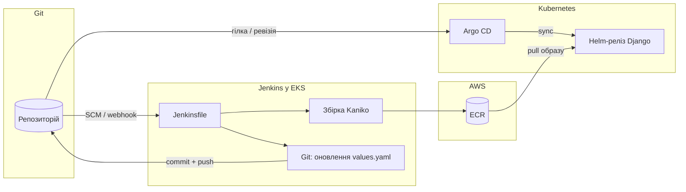
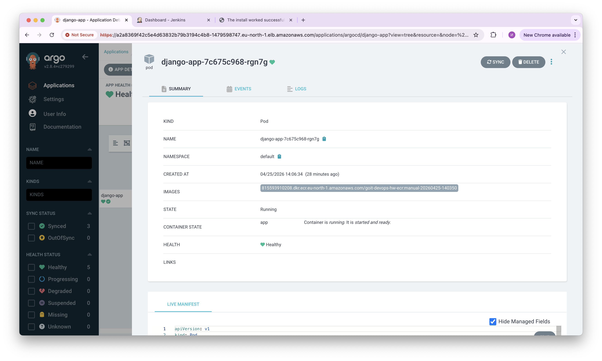
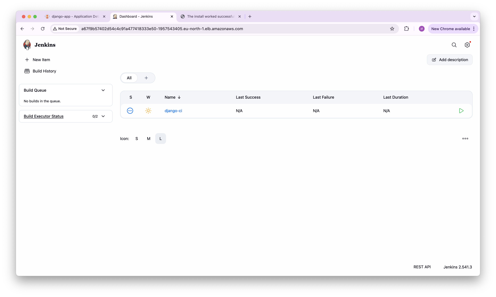
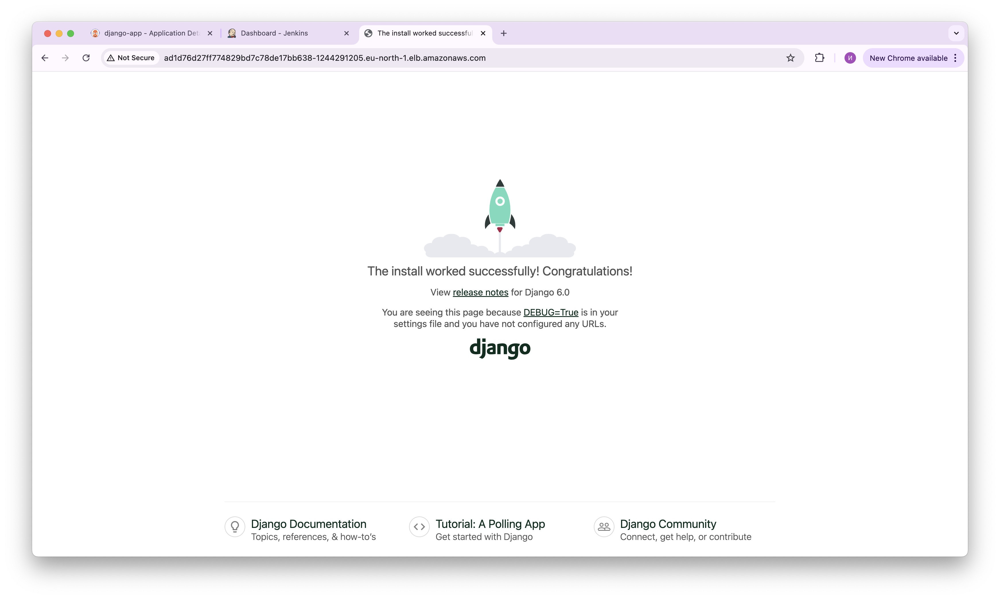
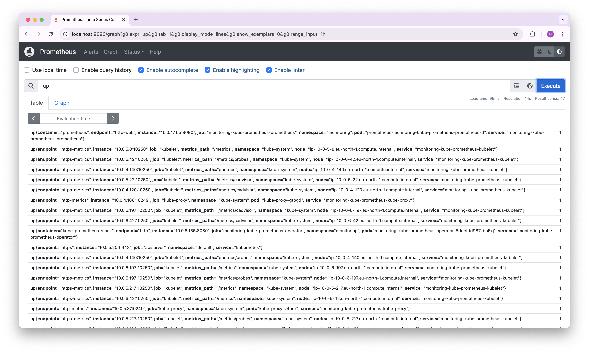
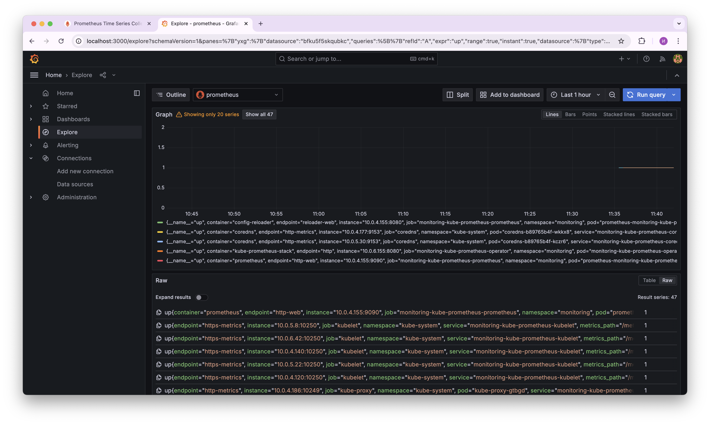

# Фінальний проєкт — GoIT DevOps

Репозиторій містить інфраструктуру на **AWS**, описану **Terraform**: **VPC**, **EKS**, **RDS**, **ECR**, **S3** для стейту, **Jenkins** і **Argo CD** у кластері (Helm), окремі Helm-релізи **Prometheus** та **Grafana** для моніторингу, а також **CI/CD** (Kaniko → ECR → оновлення Git → GitOps) для застосунку **Django** у вигляді Helm-чарту.

## Зміст

- [Структура репозиторію](#структура-репозиторію)
- [Склад стеку](#склад-стеку)
- [Архітектура CI/CD](#архітектура-cicd)
- [База даних (RDS / Aurora)](#база-даних-rds--aurora)
- [Що потрібно перед стартом](#що-потрібно-перед-стартом)
- [Terraform: застосування та виходи](#terraform-застосування-та-виходи)
- [Перевірка Jenkins](#перевірка-jenkins)
- [Перевірка Argo CD](#перевірка-argo-cd)
- [Перевірка моніторингу (Prometheus / Grafana)](#перевірка-моніторингу-prometheus--grafana)
- [Автомасштабування застосунку (HPA)](#автомасштабування-застосунку-hpa)
- [Обмеження малих нод EKS](#обмеження-малих-нод-eks)
- [Формат здачі](#формат-здачі)
- [Докази роботи (скриншоти)](#докази-роботи-скриншоти)

## Структура репозиторію

| Шлях | Призначення |
| --- | --- |
| `main.tf`, `backend.tf`, `variables.tf`, `outputs.tf` | Кореневий стек Terraform |
| `modules/vpc`, `modules/eks`, `modules/ecr`, `modules/s3-backend`, `modules/rds` | Мережа, кластер, реєстр, бакет для стейту, база даних |
| `modules/monitoring` | Окремі Helm-чарти **prometheus-community/prometheus** та **grafana/grafana**, namespace `monitoring` (за замовчуванням) |
| `modules/jenkins` | Helm-реліз Jenkins + IRSA для `jenkins-sa` (push у ECR) |
| `modules/argo-cd` | Helm-реліз Argo CD + локальний чарт застосунків |
| `charts/django-app` | Чарт застосунку (джерело для Argo CD; оновлення тегу образу з Jenkins); за потреби **HPA** за CPU |
| `django-app/` | Контекст збірки Docker для Kaniko |
| `Jenkinsfile` | CI: Kaniko, ECR, коміт змін у Git |

## Склад стеку

Кореневий `main.tf` збирає модулі в логічному порядку: **мережа (VPC) → EKS → ECR**, далі **RDS**, **S3-backend**, робочі навантаження в кластері (**Jenkins**, **Argo CD**, **Prometheus** + **Grafana**). Застосунок доставляється через **Argo CD** з репозиторію; образ збирає **Jenkins** і пушить у **ECR**.

## Архітектура CI/CD



**Кроки:**

1. Зміни в коді потрапляють у Git; Jenkins запускає пайплайн з `Jenkinsfile`.
2. **Kaniko** збирає образ з `django-app/Dockerfile` і пушить у **ECR** (агент використовує **`jenkins-sa`** + **IRSA**).
3. Етап **Git** оновлює `charts/django-app/values.yaml` (`image.repository` / `image.tag`) і пушить у вказану гілку (за замовчуванням `main`).
4. **Application** у Argo CD стежить за тим самим шляхом у репо; увімкнено **автосинхронізацію** (`prune`, `selfHeal` у `modules/argo-cd/argo_cd.tf`).

**Гілка для пайплайну та GitOps:** `main` (узгоджено з `gitops_target_revision` і параметром `GIT_PUSH_BRANCH` у Jenkins за замовчуванням).

## База даних (RDS / Aurora)

У репозиторії є модуль [`modules/rds`](modules/rds), який створює:

- **звичайну RDS instance** (PostgreSQL/MySQL), якщо `use_aurora = false`
- **Aurora cluster + writer + readers**, якщо `use_aurora = true`

В обох сценаріях створюються **DB Subnet Group**, **Security Group** та **Parameter Group** (для Aurora — cluster parameter group).

### Приклад використання

У корені це підключено в [`main.tf`](main.tf) як `module "rds"`. Мінімум потрібних змінних:

- `rds_master_password` (sensitive) — задайте в `terraform.tfvars` або через `TF_VAR_rds_master_password`
- `rds_use_aurora` — перемикач Aurora/RDS

Приклад `terraform.tfvars` (не комітьте):

```hcl
rds_master_password = "CHANGE_ME"
rds_use_aurora      = false
```

### Змінні модуля

Модуль приймає (деталі див. у [`modules/rds/variables.tf`](modules/rds/variables.tf)):

- **`use_aurora`**: `true/false` — перемикає Aurora vs стандартний RDS
- **RDS-only**: `engine`, `engine_version`, `parameter_group_family_rds`, `allocated_storage`, `multi_az`
- **Aurora-only**: `engine_cluster`, `engine_version_cluster`, `parameter_group_family_aurora`, `aurora_replica_count`
- **Network**: `vpc_id`, `subnet_private_ids`, `subnet_public_ids`, `publicly_accessible`
- **Common**: `name`, `instance_class`, `db_name`, `username`, `password`, `backup_retention_period`, `parameters`, `tags`

### Як змінити тип БД / engine / клас інстансу

- **Перемкнути Aurora**: встановіть `rds_use_aurora = true` (це **знищить** `aws_db_instance` і створить кластер Aurora в тому ж state)
- **Змінити RDS engine**: у `module "rds"` змініть `engine` / `engine_version` і відповідний `parameter_group_family_rds`
- **Змінити Aurora engine**: змініть `engine_cluster` / `engine_version_cluster` і `parameter_group_family_aurora`
- **Змінити клас інстансу**: `instance_class = "db.t3.micro"` (або інший)

> Примітка (Free tier): у модулі дефолт `backup_retention_period = 0` для стандартного RDS (щоб не впиратися в обмеження free plan). Для Aurora значення 0 автоматично піднімається до 1 дня.

## Що потрібно перед стартом

- **Terraform** `>= 1.10`
- **AWS CLI** (`aws configure` або змінні оточення) з правами на ресурси, які створюють модулі (EKS, EC2, IAM, ECR, S3 тощо)
- **kubectl**; **Helm** — бажано для перевірки релізів
- **GitHub:** токен (PAT) з правами на репозиторій для кроку пушу в пайплайні

**Стейт Terraform:** у [`backend.tf`](backend.tf) налаштовано S3 backend (бакет `goit-devops-hw-tfstate-001001`, регіон `eu-north-1`); параметри блокування відповідають актуальній конфігурації Terraform. Модуль `s3_backend` створює бакет у тому ж стеку. Якщо на **новому** акаунті `terraform init` скаржиться на відсутній бакет — один раз створіть бакет вручну або тимчасово використайте локальний backend і перенесіть стейт (див. [документацію Terraform про S3 backend](https://developer.hashicorp.com/terraform/language/settings/backends/s3)). Щоб запобігти проблемам при видаленні інфраструктури (`terraform destroy`), перенесіть стейт у локальний backend перед викликом команди.

## Terraform: застосування та виходи

З кореня репозиторію:

```bash
cd /шлях/до/goit-devops-hw
terraform init
terraform plan
terraform apply
```

Якщо ваш fork інший за значення за замовчуванням у `variables.tf`:

```bash
export TF_VAR_gitops_repo_url="https://github.com/<ВИ>/<РЕПО>.git"
terraform apply
```

**Секрети** (`terraform.tfvars`, `TF_VAR_rds_master_password`, `TF_VAR_grafana_admin_password` тощо) **не комітьте**.

Після успішного `apply` підключіть **kubeconfig**:

```bash
aws eks update-kubeconfig --region eu-north-1 --name goit-devops-hw-eks
```

**Корисні виходи:**

```bash
terraform output ecr_repository_url
terraform output eks_configure_kubeconfig
terraform output jenkins_namespace
terraform output argo_cd_admin_password_command
terraform output monitoring_namespace
terraform output grafana_admin_password_command
terraform output monitoring_prometheus_port_forward
terraform output monitoring_grafana_port_forward
```

Пароль адміна Grafana також можна задати через `TF_VAR_grafana_admin_password` (за замовчуванням у модулі моніторингу використовується пароль з прикладу курсу; для реального середовища змініть).

## Перевірка Jenkins

1. **Веб-інтерфейс:** зовнішня адреса контролера (у чарті — `LoadBalancer`, див. `modules/jenkins/values.yaml`):

   ```bash
   kubectl get svc -n jenkins
   ```

   Відкрийте `http://<EXTERNAL-IP>:80`. Логін і пароль адміністратора — як у `modules/jenkins/values.yaml`.

2. **Плагін Kubernetes:** якщо агенти не стартують, перевірте налаштування **Kubernetes cloud** у Jenkins (інколи потрібна одноразова конфігурація в UI).

3. **Облікові дані:** у Jenkins додайте облікові записи з ID **`github-token`** (логін GitHub + PAT) — їх використовує `Jenkinsfile`.

4. **Pipeline:** створіть job типу Pipeline з **SCM**, вкажіть цей репозиторій і гілку `main`, шлях до скрипта — **`Jenkinsfile`**.

5. **Запуск:** виконайте збірку; мають пройти етапи **Checkout → Resolve ECR → Build and push (Kaniko) → Bump Helm values and push** (параметри описані на початку `Jenkinsfile`).

## Перевірка Argo CD

1. **kubectl** уже налаштований (див. вище).

2. **URL сервера:** Argo CD сервер виставлений як `LoadBalancer` (`modules/argo-cd/values.yaml`):

   ```bash
   kubectl get svc -n argocd
   ```

   Використовуйте **EXTERNAL-IP**, підключення по **HTTPS**, порт **443** (як у values).

3. **Початковий пароль адміна:**

   ```bash
   kubectl -n argocd get secret argocd-initial-admin-secret \
     -o jsonpath="{.data.password}" | base64 -d
   echo
   ```

   Користувач: **`admin`**.

4. **Application:** у UI відкрийте **Applications** → застосунок **`django-app`** (ім’я з `modules/argo-cd/variables.tf`). Очікуйте статуси **Synced** та **Healthy**, коли в Git коректний чарт і образ.

## Перевірка моніторингу (Prometheus / Grafana)

Після `terraform apply` у namespace **`monitoring`** (за замовчуванням) встановлені окремі Helm-релізи **Prometheus** та **Grafana**.

```bash
kubectl get all -n monitoring
helm list -n monitoring
```

**Доступ до UI** (з локальної машини, окремі термінали):

- Виконайте команди з виходів Terraform: `terraform output -raw monitoring_prometheus_port_forward` та `terraform output -raw monitoring_grafana_port_forward` (Prometheus: зазвичай `http://localhost:9090`, Grafana: `http://localhost:3000`).
- Пароль адміна Grafana: `terraform output -raw grafana_admin_password_command` (користувач за замовчуванням `admin`, якщо не змінювали в чарті).

У Grafana перевірте джерело даних **Prometheus** та наявність метрик / дашбордів згідно з вимогами перевірки.

## Автомасштабування застосунку (HPA)

У [`charts/django-app`](charts/django-app) увімкнено **HorizontalPodAutoscaler** (ресурс **CPU**, цільове навантаження **80%**, **1–3** репліки — див. [`templates/hpa.yaml`](charts/django-app/templates/hpa.yaml) та [`values.yaml`](charts/django-app/values.yaml)).

## Обмеження малих нод EKS

У модулі `modules/eks` за замовчуванням використовуються інстанси **`t3.micro`**: мало оперативної пам’яті та низька щільність подів на ноду. У **Jenkins** контейнер **`init`** завантажує плагіни через Java; при малому ліміті пам’яті можливий **`OutOfMemoryError`** під час роботи з `plugin-versions.json`. Для стабільного запуску потрібні більші типи інстансів, більше нод, менший набір плагінів або образ Jenkins з уже встановленими плагінами.

## Скриншоти

Нижче — ілюстрації робочого стеку (Argo CD, Jenkins, застосунок, Prometheus, Grafana).



*Argo CD: синхронізація та стан застосунку.*



*Jenkins: збірка та публікація образу.*



*Django: доступність сервісу / робота застосунку.*



*Prometheus: перевірка збору метрик.*



*Grafana: візуалізація метрик.*
